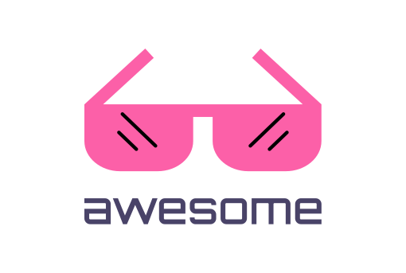

   
  
   
   

<h2 align='center'>Awesome shadcn/ui</h2>

A curated list of awesome things related to <a href='https://ui.shadcn.com/'>shadcn/ui</a>
  

## Libs and Components
- [shadcn-table-v2](https://github.com/sadmann7/shadcn-table-v2) - shadcn/ui table component with server-side sorting, filtering, and paginationPrisma..
- [shadcn-phone-input](https://shadcn-phone-input.vercel.app/) - Customizable phone input component with proper validation for any country. Built on top of shadcn.
- [react-dnd-kit-tailwind-shadcn-ui](https://georgegriff.github.io/react-dnd-kit-tailwind-shadcn-ui/) - Drag and drop Accessible kanban board implementing using React, @dnd-kit, tailwind and shadcn/ui
- [shadcn/ui expansions](https://shadcnui-expansions.typeart.cc/) - shadcn/ui expansions collect lots of useful components which shadcn/ui does not have out of box. All the components are base on shadcn/ui. Just copy and paste. The component is yours.
- [Fancy Multi Select](https://craft.mxkaske.dev/post/fancy-multi-select) - The Multi Select Component is inspired by campsite.design's and cal.com's settings forms.
- [auto-form](https://github.com/vantezzen/auto-form) - A React component that automatically creates a @shadcn/ui form based on a zod schema.
- [date-range-picker-for-shadcn](https://github.com/johnpolacek/date-range-picker-for-shadcn) - Includes multi-month views, text entry, preset ranges, responsive design and date range comparisons.

## Ports
- [Svelte](https://github.com/huntabyte/shadcn-svelte) - Svelte port of shadcn/ui
- [Vue](https://github.com/radix-vue/shadcn-vue) - Vue port of shadcn/ui
- [React Native](https://github.com/Mobilecn-UI/nativecn-ui) - React Native port of shadcn/ui
- [Swift](https://github.com/Mobilecn-UI/swiftcn-ui) - Swift port of shadcn/ui
- [Flutter](https://github.com/nank1ro/shadcn-ui) - Flutter port of shadcn/ui
- [Ruby](https://github.com/aviflombaum/shadcn-rails) - Ruby port of shadcn/ui

## Boilerplates
- [taxonomy](https://github.com/shadcn/taxonomy) - An open source application built using the new router, server components and everything new in Next.js
- [turborepo-shadcn-ui-tailwindcss](https://github.com/henriqpohl/turborepo-shadcn-ui-tailwindcss) - Turborepo starter with shadcn/ui & Tailwind CSS pre-configured for shared ui components.